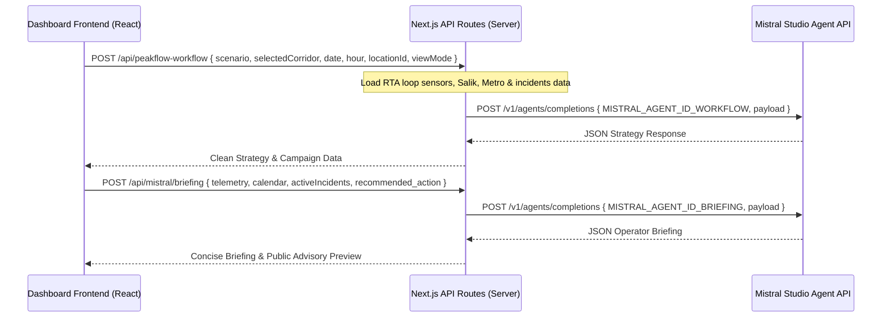

# RTA PeakFlow - Mistral Studio Agent API Migration Report

This report documents the migration of PeakFlow's AI logic from hardcoded local prompts and local Python durable workflows to cloud-hosted **Mistral Studio Agents** queried securely via server-side Next.js API routes.

---

## Summary of Changes

### 1. Files Deleted
*   `../peakflow-mistral-workflow` (Entire Python workflows backend directory deleted).
*   `src/app/api/mistral/chat/route.ts` (Chat assistant route deleted).
*   `src/app/components/AiChatPanel.tsx` (Chat assistant UI panel deleted).
*   `docs/mistral-workflow-integration.md` (Outdated local execution guide deleted).

### 2. Files Modified
*   **[src/app/page.tsx](file:///Users/m-alkassem/Desktop/RTA%20Competition/rta-peakflow-copilot/src/app/page.tsx):**
    *   Removed `AiChatPanel` import and tab rendering logic.
    *   Added tracking properties `date`, `hour`, `locationId` (selectedLocationId), and `viewMode` to the campaign optimizer request body.
    *   Added `setBriefing(null)` inside the reset `useEffect` to clear old briefings when location or hour updates.
*   **[src/app/lib/types.ts](file:///Users/m-alkassem/Desktop/RTA%20Competition/rta-peakflow-copilot/src/app/lib/types.ts):**
    *   Removed `'chat'` from the `ActiveTab` union type.
*   **[src/app/components/ControlSidebar.tsx](file:///Users/m-alkassem/Desktop/RTA%20Competition/rta-peakflow-copilot/src/app/components/ControlSidebar.tsx):**
    *   Removed `|| tab === 'chat'` comparison logic from side-navigation checks.
*   **[src/app/api/peakflow-workflow/route.ts](file:///Users/m-alkassem/Desktop/RTA%20Competition/rta-peakflow-copilot/src/app/api/peakflow-workflow/route.ts):**
    *   Completely refactored. Removed all Python subprocess exec / `uv run python` calls.
    *   Removed all local hardcoded prompt templates.
    *   Implemented direct server-side calls using the shared `callMistralAgent` helper, passing the grounded calendar context, traffic parameters, incidents, Salik toll data, and Metro ridership daily logs to the **PeakFlow Congestion Prevention Optimizer Agent** (`MISTRAL_AGENT_ID_WORKFLOW`).
*   **[src/app/api/mistral/briefing/route.ts](file:///Users/m-alkassem/Desktop/RTA%20Competition/rta-peakflow-copilot/src/app/api/mistral/briefing/route.ts):**
    *   Completely refactored. Removed all local hardcoded briefing prompt templates and fallback completions.
    *   Implemented direct server-side calls using the shared `callMistralAgent` helper, passing the selected corridor's telemetry, congestion details, recommended shift actions, and calendar weather/incident context to the **PeakFlow Operator Briefing Agent** (`MISTRAL_AGENT_ID_BRIEFING`).
*   **[src/app/components/AiBriefingPanel.tsx](file:///Users/m-alkassem/Desktop/RTA%20Competition/rta-peakflow-copilot/src/app/components/AiBriefingPanel.tsx):**
    *   Refactored to automatically query `/api/mistral/briefing` when mounted or on selected corridor change.
    *   Displays clear loading and error states ("*AI analysis unavailable. Please retry or check Mistral Agent configuration.*").
    *   Renders dynamic briefings generated by the Mistral Studio Briefing Agent.
    *   Displays a clear badge indicating generation by Mistral Studio Agent and the requirement of operator approval.
*   **[README.md](file:///Users/m-alkassem/Desktop/RTA%20Competition/rta-peakflow-copilot/README.md) & [agent.md](file:///Users/m-alkassem/Desktop/RTA%20Competition/rta-peakflow-copilot/agent.md):**
    *   Updated text to reflect the pure Mistral Agent REST API architecture and clean development commands.

### 3. Files Created
*   **[src/lib/mistral/agents.ts](file:///Users/m-alkassem/Desktop/RTA%20Competition/rta-peakflow-copilot/src/lib/mistral/agents.ts):**
    *   Server-only utility helper function `callMistralAgent()` that validates environmental configuration (keys and agent IDs), handles non-200 responses and abort signals/timeouts, and reports clean server-side logs without leaking secrets.

---

## Required Environment Configuration
Add the following to your frontend `.env` (or `.env.local`) file:
```env
MISTRAL_API_KEY=1eK9aRKdto2cI4loSOE039VAhkTnT10f
MISTRAL_AGENT_ID_BRIEFING=ag_019f220b7bd170ecaae41c02b4db2425
MISTRAL_AGENT_ID_WORKFLOW=ag_019f220e4072736698e87b8de7293b20
```

---

## New API Execution Flow


---

## How to Test and Verify

1.  **Restart Next.js:**
    ```bash
    npm run dev
    ```
2.  **Verify UI Elements:**
    *   Select a corridor (e.g., Al Garhoud Bridge or Sheikh Zayed Road).
    *   Click **"Run AI Analysis"** under the *Demand Campaign Planner* tab. The campaign mix matrix, optimizer reasoning, and strategy comparisons will load directly from the **Congestion Prevention Optimizer Agent**.
    *   Switch to the **"Shift Briefing"** tab. The panel will show a loading spinner, query the **Operator Briefing Agent**, and display the structured operator instructions, roadside CMS warnings, and approval warnings.
    *   Verify that changing the Selected Hour or Corridor resets the states and prompts new fetches.
3.  **Security Check:**
    *   Inspect browser network responses. Your `MISTRAL_API_KEY` and specific Agent configurations are fully hidden on the server and never leaked to the client.
